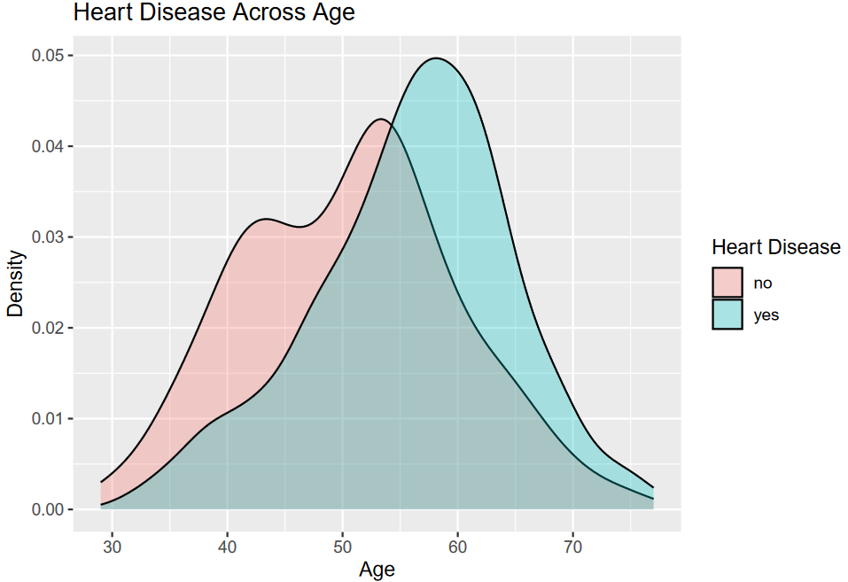
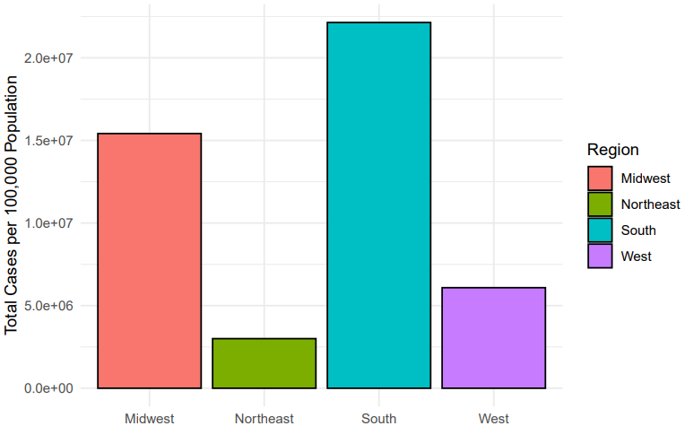
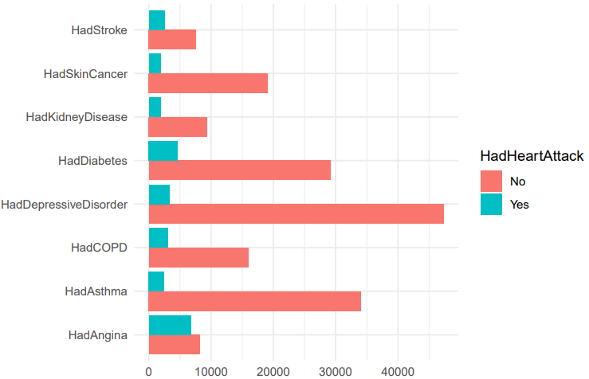
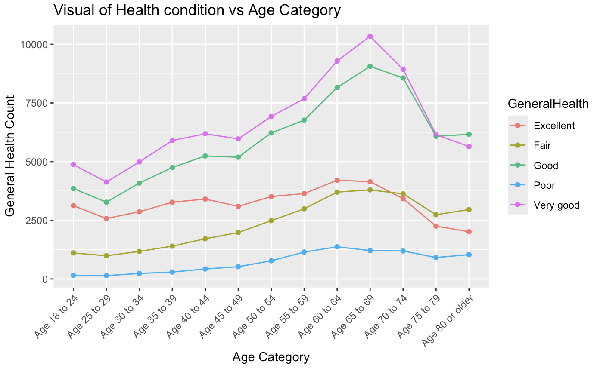
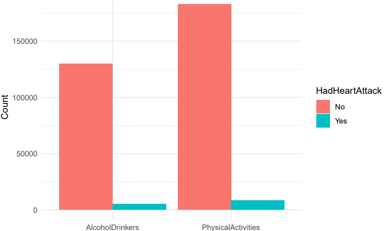
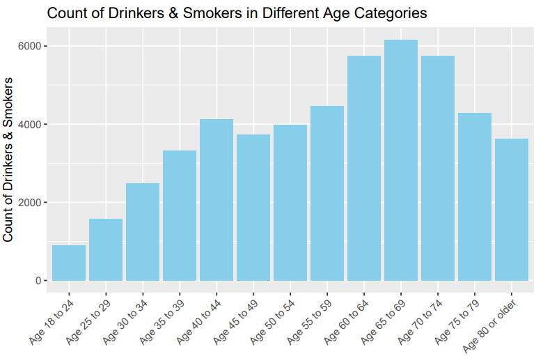
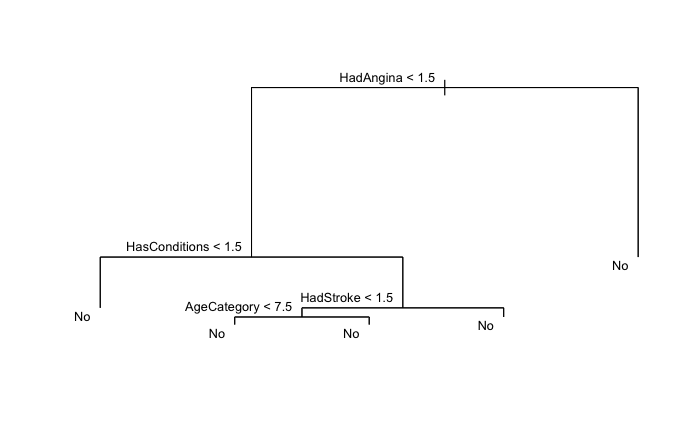
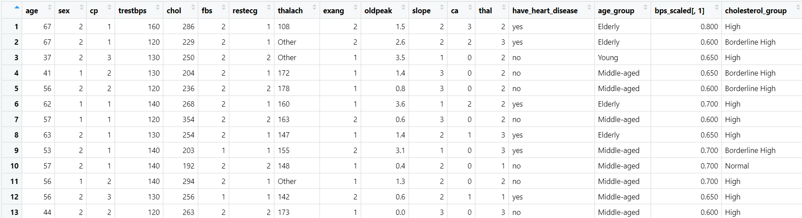
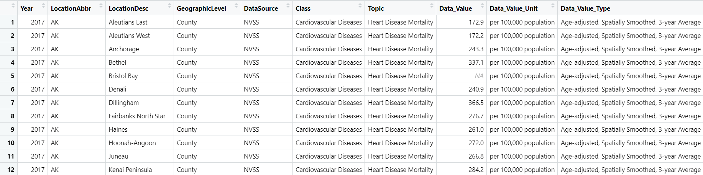
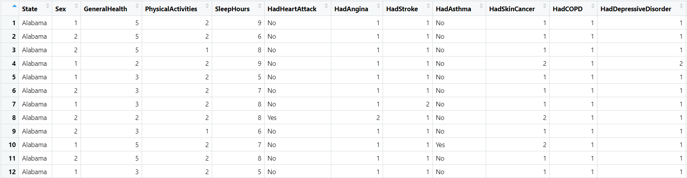

# 1. Summary
Heart disease is a leading cause of death in the United States. According to the CDC, every 33 seconds, there will be one person in the US who dies due to cardiovascular disease. And every year around 800,000 people have heart attacks, of which 1 in 5 cases will be silent heart attacks. In addition, heart disease causes around $200 billion each year just from 2018 to 2019. This prompts our project's focus on leveraging data to tackle this critical health issue.
Our project aims to predict the likelihood of heart disease, heart attack, and the mortality rate of heart disease based on different factors. By doing so, we can lay the groundwork for interventions and create plans and strategies to predict the risk of heart patients in the future.

We gathered data from different sources - Kaggle, UCI, and CDC, which have different information including demographic information, crucial indicators such as cholesterol levels, resting blood sugar, chest pain type and geography information. The data from Kaggle gave us information about the lifestyle and the medical history of patients who did and did not experience heart attacks including their lifestyle like exercise, sleep, smoking, underlying health, etc. The UCI data collected cardiac data from thousands of candidates who did and did not have heart disease. Apart from these datasets, we also used data from the CDC which contained stroke and heart mortality based on region, sex, and race. 

Following the data science workflows, we imported and cleaned the dataset to ensure their suitability for analysis. We performed exploratory data analysis on the data to find the trends and primary contributors to heart disease. Reflecting on the inferences, we applied feature engineering techniques to simplify and help enhance the model performances. We splitted our data into training/testing and then built and trained our models -  linear regression, logistic regression, neural network, and decision tree to predict the risk of heart disease based on the common factors we found in EDA. Furthermore, we calculated ROC curves, sensitivity, specificity, and F-1 scores in order to evaluate our models’ accuracy. Finally, we observed and culminated the insights from the results from models and drew conclusions regarding the efficacy of our predictive models.

# 2. Methods

## 2.1 Data Processing

We imported and cleaned our datasets to prepare and ensure that our datasets were standardized, cleaned, and ready for further analysis which will help us easily identify and find meaningful insights into heart disease and related factors. Each dataset was cleaned differently but missing values were handled similarly to ensure consistency and clarity. Missing values in numeric columns are replaced with mean values while missing categorical values are replaced with mode values. 

**a. Kaggle :**
The creators mainly cleaned the dataset but we removed unnecessary columns like *PhysicalHealthDays*, and *MentalHealthDays* as their information was already expanded and detailed in other columns. 

**b. UCI :**
The datasets from UCI had different files that contained the data from different locations but they all conducted the same data. The initial dataset does not have columns’ names so we renamed the columns of the dataset based on the documents provided by the source All numerical columns such as gender, chest pain type, fasting blood sugar, etc., are transformed into meaningful categories, and the values were also based on the documents.

**c. CDC :**
The dataset had several similar columns that expressed the details of locations like lat, long, or descriptions and abbreviations of other columns. Those columns were removed since we just wanted to analyze the relationship between the locations and heart disease. Additionally, a *Region* column was added to categorize locations (Northeast, Midwest, South, and West) based on their states, this was useful for us to identify the mortality rates based on the locations. Lastly, we renamed *Data_Value* column to *Data_Value_Per_100000_Population* to make it clearly show where the value was from.

## 2.2 Feature Engineering

Various important transformations were used in feature engineering for heart disease analysis to understand the effects of different factors on heart health. Age binning was applied to distinguish between age groups and understand how varying age ranges impact the risk of heart disease. BMI binning was used to classify people according to their BMI and determine how it affected their risk of heart disease. To understand how sleep patterns affect heart health, sleep category binning was used. In order to determine the connection between vaccination and health status, a binary variable was developed using feature combination to indicate whether a person is vaccinated and whether they have any pre-existing conditions. The analysis of the contributions of these factors to heart disease was determined by the application of one-hot encoding, which transformed categorical variables into binary form. When combined, these methods improve the precision of the analysis of heart disease which leads to a more sophisticated comprehension of its causes.

## 2.3 Exploratory Data Analysis (EDA)

We performed EDA to help us better understand the data and identify the patterns, trends, and relationships between factors. We started by analyzing the relationship between age, sex, and heart disease to determine which demographic group is the most commonly affected. The graph in *Figure 1* confirms that most people having heart disease peak in old age, while those without heart disease are evenly distributed across ages. In addition, besides ages, we wanted to know how the region and the practices, environment, and habits that come with the region affect the probability of getting heart attacks. We plot bar graphs that display the total cases of heart disease per 100,000 population across different regions. 

{width=305px}

{width=305px}

*Figure 3* presents the medical history distribution of patients who did and did not experience heart attacks. We can conclude that various underlying health conditions are associated with heart attacks. The largest number of patients who had heart attacks were with Diabetes, Cancer, COPD, Asthma, and Depressive Disorder, indicating these are the most common conditions contributing to the risk of having heart attacks. The visualization in Figure 4 illustrates that individuals with the highest number of good, very good, and excellent general health fall under the age category of 65 to 69, which is surprising given they are among one of the most prone to heart disease age categories. This goes to show that symptoms, and external factors like diet, habits etc play a major role in the probability of getting a heart attack.

{width=305px}
{width=305px}

Furthermore, because Figure 4 shows that most people in group 65-74 have excellent health but *Figure 1* demonstrates that most people having heart disease peak in old age, we plotted boxplot (*Figure 5*) to observer the lifestyle and to identify whether or not lifestyle also contributes to the risk of heart attack. The plot shows that most people who experienced heart attacks did not usually exercise, but surprisingly, the majority of patients who drank alcohol did not have heart attacks. To analyze further to see which age, drinking, and smoking affect the patients experiencing heart attacks, we plotted the histogram graph shown in *Figure 6*. The graph visualizes the count of drinkers and smokers across different age categories, highlighting higher prevalence among older age groups. This gives us another solid factor as to why individuals in the older age category are more likely to get heart attacks.

{width=305px}
{width=305px}

## 2.4 Data Preparation for Model Input

All the datasets were split into training and testing data - 80/20 since it is the best way to access the ability of the models into the new data. We used the training data to fit the model and testing to evaluate the accuracy of the model. 

## 2.5 Feature Selection

We want to find the relationship between heart disease mortality rates and other factors in the dataset like regions, races, and sex. Since the data values for the mortality rate - *Data_Value_Per_100000_Population* - a continuous values, we plan to use linear regression in this dataset. We find the best predictors for the models based on BIC values (*Table 1*). We chose the model which has the least BIC, which is *Region + Sex + Age*

| Models             | BIC   |
| :---------------- | :---: |
| Region             | 103.6074 |
| Region + Sex       | 98.89635 | 
| Region + Sex + Age | 91.56468 |

Table: BIC result for Linear Regression model

Additionally, EDA shows that all health factors contribute to the chances of having heart disease; therefore, for the models for logistic regression, we chose all the attributes from the datasets (general health, medical history, lifestyle, geographic and demographic information)

## 2.6 Models

**a. Linear Regression**

With the selected predictors mentioned in *Section 2.5*, we fit the training data into the model and predicted the relationship between the heart disease mortality rate with demographic and geographic information. In addition, we chose *MSE - mean squared error* - to evaluate the model since *MSE* as its conceptually straightforward and is one of the common ways to evaluate the predictive models. The results and metrics of this model are discussed in the Result section (Section 3).

**b. Logistic Regression**

We applied logistic regression models to predict the risk of having heart disease using datasets from Kaggle and UCI, which are called *Model 1* and *Model 2*, respectively, since dependent values in both of the datasets are encoded into binary. *Model 1* has *have_heart_disease* as the dependent variable, while *Model 2* uses *HadHeartAttack* as a dependent variable. We used different health factors as predictors in *Model 1* but in *Model 2*, we also included lifestyle factors.

In addition to evaluating the accuracy of the model, we calculated the area under ROC curves, sensitivity, specificity, and F-1 scores. Each of these metrics gives different insights. The sensitivity to measure where missing out on true positives has severe consequences, while specificity helps to measure false positives. The ROC curves show the performance of a classification model at all classification thresholds and F-1 helps us not overlook the importance of either precision or recall. The results and metrics of this model are discussed in the Result section *(Section 3)*.
 
**c. Decision Tree **

We used Decision Tree to predict and support the logistic regression model for the prediction of heart attack risk since EDA overall does not show us which are the important factors that cause heart attack, and the Decision Tree model can handle the complex and non-linear relationship between features and offers us excellent interpretability. The results and metrics of this model are discussed in the Result section *(Section 3)*.

**d.Neural Networks**

We wanted to know how the neural network model performed when we trained the model with the same parameters. The neural network model was trained to predict if the person will have a heart attack in the future when given the various variables. The results and metrics of this model are discussed in the Result section *(Section 3)*.

# 3. Results

Based on the analysis from our EDAs, we can conclude that demography and underlying health are the primary factors contributing to the chances of having heart disease and heart attack. In addition to age, sex, and medical history, smoking and alcohol consumption in older age and not doing exercise regularly also contribute to the probability of having heart attacks. Furthermore, our analysis shows that there is a link between the demographic and geographic factors in the mortality rates of heart disease, as *Figure 2* illustrates that the South region stands out with a significantly higher number of mortality cases. 

To confirm the hypothesis we conclude from EDAs, we then created and compared 5 different models - 2 logistic regression, 1 linear regression, 1 neural network, and 1 decision tree to predict the risk of having heart disease, heart attack, and mortality rate which are based on different factors found from EDAs. 

## 3.1 Logistics regression model

As for the logistic regression models, we conducted two different models - *Model 1 and Model 2*, respectively, based on two datasets UCI and Kaggle to predict the chances of having a heart attack and heart disease (*Table 2*). Model 1 performs well in specificity and F1- score with a decent accuracy, 76.77%. F1-score - above 80% shows us that there is a good balance between precision and recall indicating Model 1 is fairly reliable to use to predict the risk of heart disease with just based on different health factors. 

|   	| Accuracy	|  Sensitivity 	|  Specificity 	| F1-score	| AUC	|
| :---:	| :---:	| :---:	| :---:	| :---:	| :---:	|
| Model 1  	|  0.7677 	|  0.6429	|  0.8596 	|  0.8099174 	| 0.7799 |
| Model 2	|   09488	|  0.9896 	|  0.2423 	|  0.3404812 	| 0.9027 |

Table: Accuracy, Sensitivity, Specificity, F1, and AUC scores of logistic regression models

In the linear regression model, as mentioned in *section 2.5*, we chose *Region, Sex, and Age* as predictors for the model and fit in the training data. However, we got the *MSE* values of 8384.09 which is too high, and R-square values of 0.2539, which is too low (*Table 3*). It suggests that the model lacks predictive strength, more data and variables may be needed to have a better model.

## 3.2 Decision Tree Model

The root node splits on the *HadAngina* variable. Left branch - *HadAngina < 1.5* and right branch -  *HadAngina > 1.5*. We further see that the left branch then further splits on the *HasConditions* variable, with those having *HasConditions < 1.5* being classified as "No" (no heart attack) and those with *HasConditions > 1.5* splitting again on the *HadStroke* variable. The right branch with *HadAngina > 1.5* is classified as "No" (no heart attack). The tree has 5 terminal nodes, representing the final predictions.

The variables used in the tree construction are *HadAngina*, *HasConditions*, *HadStroke*, and *AgeCategory*.  This indicates these variables are the most important predictors in the model.

## 3.3 Neural Network Model

We wanted to know how the neural network model performed when we trained the model with the same parameters. The neural network model was trained to predict if the person will have a heart attack in the future when given the various metrics mentioned above. 

The neural network model accurately predicts if the person will suffer from a heart attack or not. The accuracy of the model is  94.53%

# 4. Discussions

# 5. Statement of Contributions

|                   | Maalolan Bharaniraj | Ngoc Khanh Vy Le | Madhuri Krishnamurthy | Subhankar Shah
| :---------------: | :------: | ----: | :------: | ----: |
| Data Processing                     |  | \checkmark | \checkmark |  |
| DExploratory Data Analysis          | \checkmark | \checkmark |  |  |
| Feature Engineering                 |  |  | \checkmark |  |
| Data Preparation + Feature Selection|  | \checkmark |  |  |
| Linear Regression                   |  | \checkmark |  |  |
| Logistic Regression                 |  | \checkmark |  | \checkmark |
| Decision Tree + Neural Networks     |  |  |  | \checkmark |
| Model Evaluation + Insights         |  | \checkmark |  | \checkmark |
| Project Report                      | \checkmark | \checkmark | \checkmark | \checkmark |

# 6. References

1. Dataset:

  * Heart Disease Mortality Data Among US Adults (35+) by State/Territory and County – 2016-2018
  [https://catalog.data.gov/dataset/heart-disease-mortality-data-among-us-adults-35-by-state-territory-and-county-2016-2018-c0d58](https://catalog.data.gov/dataset/heart-disease-mortality-data-among-us-adults-35-by-state-territory-and-county-2016-2018-c0d58)

  * Indicators of Heart Disease
  [https://www.kaggle.com/datasets/kamilpytlak/personal-key-indicators-of-heart-disease](https://www.kaggle.com/datasets/kamilpytlak/personal-key-indicators-of-heart-disease)

  * UCI - Heart Disease
  [https://archive.ics.uci.edu/dataset/45/heart+disease](https://archive.ics.uci.edu/dataset/45/heart+disease)

2. Paper references

* Detrano, Robert C. et al. “International application of a new probability algorithm for the diagnosis of coronary artery disease.” The American journal of cardiology 64 5 (1989): 304-10.

* “Heart Disease.” Centers for Disease Control and Prevention, U. S. Department of Health and Human Services, 19 Jan. 2021,
[https://www.cdc.gov/heartdisease/index.htm](https://www.cdc.gov/heartdisease/index.htm)

# 7. Appendix
Screenshots of the three datasets used in the project :

